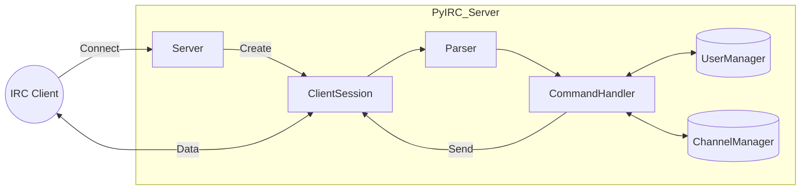

# Projekt Wstępny: Serwer IRC

**Przedmiot:** PSI 25Z  
**Projekt:** PyIRC_Server 
**Zespół:**
* Hubert Potera
* Kacper Siemionek
* Wojciech Zieziula

## 1. Treść zadania

### E. Serwer IRC

Celem projektu jest implementacja uproszczonego serwera IRC obsługującego uwierzytelnianie oraz komunikację między pojedynczymi użytkownikami, a także w kanałach (wraz z możliwością usuwania użytkowników z kanału).

* https://pl.wikipedia.org/wiki/Internet_Relay_Chat
* https://datatracker.ietf.org/doc/html/rfc1459

## 2. Założenia funkcjonalne i niefunkcjonalne

### 2.1. Założenia funkcjonalne

Serwer będzie obsługiwał podzbiór poleceń IRC niezbędny do realizacji zadania:

* **Zarządzanie połączeniem:** Obsługa komend `PASS`, `NICK`, `USER`, `QUIT`.
* **Komunikacja:** Przesyłanie wiadomości `PRIVMSG` do konkretnego użytkownika oraz na kanał.
* **Zarządzanie kanałami:** Obsługa `JOIN`, `PART`.
* **Moderacja:** Obsługa `KICK` – wyrzucanie użytkowników (dostępne dla operatora kanału).
* **Odpowiedzi:** Generowanie kodów numerycznych (np. `RPL_WELCOME`, `ERR_NICKNAMEINUSE`) zrozumiałych dla standardowych klientów IRC.

### 2.2. Założenia niefunkcjonalne

* **Technologia:** Python 3.11+ z wykorzystaniem biblioteki `asyncio` do obsługi współbieżności.
* **Jakość kodu:**
    * Pełne typowanie statyczne weryfikowane przez `mypy`.
    * Formatowanie i linting kodu przy użyciu `ruff`.
* **Zarządzanie projektem:**
    * Zależności definiowane w `pyproject.toml`.
    * Automatyzacja zadań za pomocą `Makefile`.
* **Logowanie:** Wykorzystanie biblioteki `logging` do rejestrowania zdarzeń serwerowych.

## 3. Podstawowe przypadki użycia

  **Rejestracja użytkownika:**
    * Klient nawiązuje połączenie TCP.
    * Wysyła: `NICK <nick>` oraz `USER <user> ...`.
    * Serwer sprawdza unikalność nicku.
    * W przypadku sukcesu serwer odsyła `RPL_WELCOME`.

*   **Rozmowa na kanale:**
    * Użytkownik wysyła `JOIN #kanal`.
    * Serwer dodaje użytkownika do listy członków kanału.
    * Użytkownik wysyła `PRIVMSG #kanal :Treść wiadomości`.
    * Serwer rozsyła wiadomość do wszystkich pozostałych członków tego kanału.

*   **Wyrzucenie użytkownika:**
    * Operator kanału wysyła `KICK #kanal Użytkownik :Powód`.
    * Serwer weryfikuje, czy nadawca ma uprawnienia operatora na tym kanale.
    * Serwer usuwa wskazanego użytkownika z kanału i powiadamia o tym resztę obecnych.

## 4. Analiza sytuacji błędnych

System będzie przygotowany na następujące błędy:

* **Konflikt nazw:** Próba użycia zajętego pseudonimu zwróci `ERR_NICKNAMEINUSE`.
* **Błędy składni:** Niepoprawne komendy lub brak parametrów spowodują wysłanie `ERR_NEEDMOREPARAMS` lub `ERR_UNKNOWNCOMMAND`.
* **Zerwanie połączenia:** Nagłe rozłączenie klienta zostanie wykryte przez obsługę wyjątków na gnieździe, a zasoby zostaną zwolnione.
* **Brak uprawnień:** Próba wykonania operacji uprzywilejowanej (np. `KICK`) przez użytkownika bez uprawnień zwróci `ERR_CHANOPRIVSNEEDED`.

## 5. Środowisko sprzętowo-programowe

* **System operacyjny:** Linux / WSL.
* **Język:** Python 3.11+.
* **Biblioteki:** Tylko standardowe (głównie `asyncio`, `logging`, `socket`) + biblioteki deweloperskie/testowe.
* **Narzędzia:**
    * `make` – zarządzanie procesem budowania/uruchamiania.
    * `docker` – środowisko prezentacyjne.
    * `telnet` / `HexChat` – klienci do testów manualnych.

## 6. Architektura rozwiązania

Rozwiązanie oparte jest na pętli zdarzeń (Event Loop).

**Główne moduły:**
* **Server:** Akceptuje połączenia i tworzy nowe instancje *ClientSession*.
* **ClientSession:** Zarządza gniazdem sieciowym danego klienta, odbiera i wysyła jego komunikaty.
* **Parser:** Analizuje surowe ciągi znaków i zamienia je na komedy.
* **CommandHandler:** Logika biznesowa mapująca komendy na akcje.
* **ChannelManager (Singleton):** Przechowuje stan kanałów i ich użytkowników.
* **UserManager (Singleton):** Przechowuje mapowanie wszystkich aktywnych nicków na sesje.

## 7. Sposób testowania

Testy będą uruchamiane automatycznie przy użyciu `pytest`.

1.  **Testy jednostkowe:**
    * Weryfikacja parsera protokołu IRC (czy poprawne i błędne ciągi znaków są dobrze interpretowane).
    * Testowanie metod zarządzania stanem (`ChannelManager`, `UserManager`) w izolacji od warstwy sieciowej.
2.  **Testy integracyjne:**
    * Uruchamianie pełnej instancji serwera w tle (fixture `pytest-asyncio`).
    * Symulacja klientów łączących się przez prawdziwe gniazda TCP.
    * Scenariusze: Rejestracja, wejście na kanał, wysłanie wiadomości, sprawdzenie czy inni klienci ją odebrali.
3.  **Testy odporności:**
    * Wysyłanie zniekształconych danych i zbyt długich linii, aby potwierdzić, że serwer nie ulega awarii.
    * Symulacja nagłego zerwania połączenia przez klienta.

## 8. Podział prac w zespole

* **Hubert Potera:**
    * Konfiguracja projektu (`pyproject.toml`, `Makefile`, `Docker`).
    * Implementacja warstwy sieciowej (pętla `asyncio`, obsługa gniazd TCP).
    * Obsługa sygnałów systemowych (`SIGINT`, `SIGTERM`) i logowanie zdarzeń.
* **Kacper Siemionek:**
    * Opracowanie parsera wiadomości IRC.
    * Implementacja komend związanych z rejestracją (`PASS`, `NICK`, `USER`, `QUIT`).
    * Zarządzanie listą aktywnych użytkowników (`UserManager`).
* **Wojciech Zieziula:**
    * Implementacja logiki kanałów i przesyłania wiadomości (`PRIVMSG`, `JOIN`, `PART`, `KICK`).
    * Zarządzanie stanem kanałów (`ChannelManager`).
    * Przygotowanie testów integracyjnych w `pytest`.

## 9. Harmonogram prac (Plan tygodniowy)

* **Tydzień 1 (do 20.12):**
    * Konfiguracja repozytorium, linterów (`ruff`) i typowania (`mypy`).
    * Uruchomienie prototypu serwera (echo server) w `asyncio`.
* **Tydzień 2 (do 28.12):**
    * Implementacja parsera protokołu.
    * Obsługa procesu rejestracji użytkownika i weryfikacji unikalności nicku.
* **Tydzień 3 (do 04.01):**
    * Implementacja wymiany wiadomości prywatnych (`PRIVMSG`).
    * Podstawowa obsługa kanałów (`JOIN`).
    * Przygotowanie środowiska do demonstracji.
* **Tydzień 4 (fo 11.01):**
    * **Odbiór częściowy (10.01).**
    * Implementacja opuszczania kanałów (`PART`) i obsługi wielu kanałów jednocześnie.
* **Tydzień 5 (do 18.01):**
    * Implementacja komendy `KICK` i weryfikacji uprawnień operatora.
    * Rozbudowa testów integracyjnych.
* **Tydzień 6 (do 23.01):**
    * Finalne testy i poprawki błędów.
    * Przygotowanie dokumentacji końcowej.
    * **Prezentacja projektu (23.01).**

## 10. Funkcje do odbioru częściowego

Do dnia 10 stycznia planujemy zademonstrować działający zalążek systemu, obejmujący:

1.  Możliwość uruchomienia serwera i środowiska testowego poleceniem `make`.
2.  Poprawne nawiązanie połączenia TCP przez wielu klientów jednocześnie.
3.  Przejście procesu uwierzytelniania (`NICK`, `USER`) i obsługę błędów zajętego nicku.
4.  Wymianę wiadomości tekstowych między dwoma użytkownikami (`PRIVMSG`).
